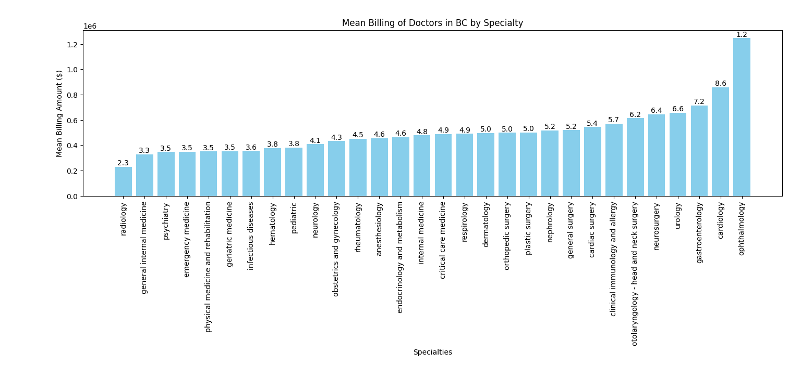

# How Much Do Medical Specialists Make? 

## What it does

The analysis is done in 3 parts:

1. extracter.py reads through the MSC Financial Statement and records doctor's names and how much money they billed in a given year
2. scraper.py goes through the [College of Physicians and Surgeons of British Columbia](https://www.cpsbc.ca/public/registrant-directory) website using Selenium and records doctor's names and their specialty
3. analysis.py takes the data gathered from above and performs statistical analysis

## How to use it

To produce the same results as the initial test:

1. Run extracter.py
2. Run scraper.py
3. Run analysis.py

## To test with other data

This project uses the data from the 2023-24 MSC Financial Statement which reports the billing amounts of doctors in British Columbia for the given year. To analyze data from different years:

1. Download the Financial Statement for the requested year [here](https://www2.gov.bc.ca/gov/content/health/practitioner-professional-resources/msp/publications)
2. Copy the financial data into a file named **bluebook.txt**
3. Run the Python files as explained in the above section. Note: if you have doctor_data.json or already ran scraper.py, you do not need to do it again. 